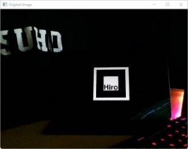
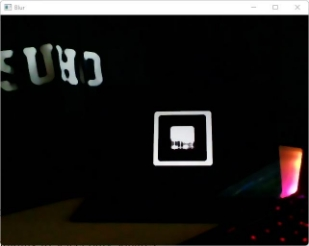
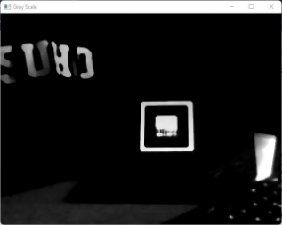
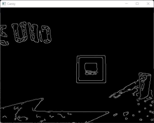
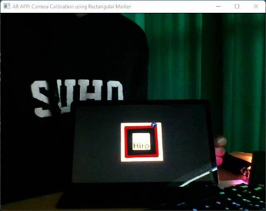
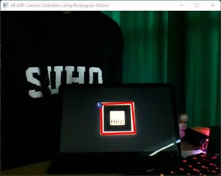
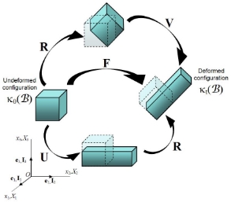
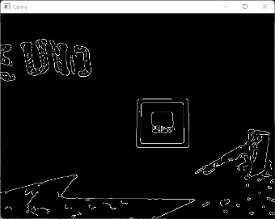
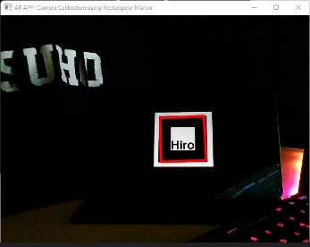
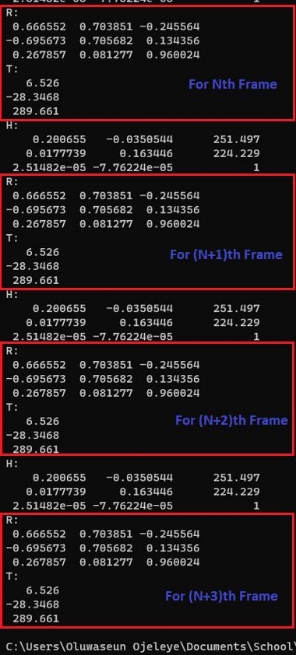

# Camera Calibration using a Rectangular Marker

## Goal Of Camera Calibration

The goal of camera calibration is to determine an accurate relationship between a 3D (marker) point in the real world and its corresponding 2D projection in an image. The inputs and outputs of the calibration system are shown below.

1. Inputs:
   - Image with points whose 2D image coordinates are known.
2. Outputs:
    - Intrinsic Parameters:
      - Camera intrinsic matrix (projection matrix)
    - Extrinsic Parameters: with respect to the reference (marker) in the world coordinate system, it includes
      - Rotation, R
      - Translation, T

## Algorithm

1. Get frame
2. Detection of Square in Image
    - Smoothing: The image was blurred using a median filter with kernel size of 9.
    - Convert the resulting image to a grayscale image.
    - Canny Edge Detection: Used a canny edge detection algorithm with a suitable thresholding parameter to find the edges within the resulting image.
    - Dilation: So as to remove potential holes between edge segments, I used a 3x3 rectangular structuring element with its anchor at the element center to dilate the resulting image.
    - Detected Contours within the resulting image.
    - Contour Selection
      - Selected only contours with  4 sides (quadrilateral)
      - Filtered out contour using area thresholding
      - Internal angle thresholding to select only squares
3. Computation of homography matrix using points of detected square and template image.
3. Homography matrix decomposition to compute for the extrinsic parameters (rotation matrix and translation vector).

## Detection of Square:

 

&nbsp;&nbsp;&nbsp;&nbsp;&nbsp;&nbsp;&nbsp;&nbsp;&nbsp;&nbsp;&nbsp;&nbsp;&nbsp;&nbsp;&nbsp;&nbsp;&nbsp;&nbsp;&nbsp;&nbsp;&nbsp;&nbsp;&nbsp;&nbsp;&nbsp;&nbsp;&nbsp;&nbsp;&nbsp;&nbsp;&nbsp;&nbsp;&nbsp;&nbsp;&nbsp;&nbsp;&nbsp;&nbsp;&nbsp;&nbsp;&nbsp;&nbsp;&nbsp;&nbsp;&nbsp;&nbsp;&nbsp;&nbsp;&nbsp;&nbsp;&nbsp;&nbsp;&nbsp;&nbsp;&nbsp;&nbsp;&nbsp;&nbsp;

 

&nbsp;&nbsp;&nbsp;&nbsp;&nbsp;&nbsp;&nbsp;&nbsp;&nbsp;&nbsp;&nbsp;&nbsp;&nbsp;&nbsp;&nbsp;&nbsp;&nbsp;&nbsp;&nbsp;&nbsp;&nbsp;&nbsp;&nbsp;&nbsp;&nbsp;&nbsp;&nbsp;&nbsp;&nbsp;&nbsp; &nbsp;&nbsp;&nbsp;&nbsp;&nbsp;&nbsp;&nbsp;&nbsp;&nbsp;&nbsp;&nbsp;&nbsp;&nbsp;&nbsp;&nbsp;&nbsp;&nbsp;&nbsp;&nbsp;&nbsp;&nbsp;&nbsp;&nbsp;&nbsp;&nbsp;&nbsp;&nbsp;&nbsp;

 

## Homography Matrix Computation

I computed the homography matrix, H with the eight points shown in the figure above with a matrix system such that the four correspondence points (p1 , p1′),(p2 , p2 ′),(p3 , p3 ′),(p4 , p4 ′) are written as 2×9 matrices such as:

I then stacked them into a matrix P to compute **PH=0**. The singular value decomposition(SVD) of matrix P was then computed and the last singular vector of **V** was selected as the solution to the homography matrix, **H**. Finally, this matrix was then normalized so that h9 = 1.

## Homography Matrix Decomposition

 

The decomposition of the matrix is shown above. The rotation matrix, R, was computed by taking the first two columns from the homography matrix as the first two columns in the rotation matrix and their cross product was used to find the last column of the rotation matrix. The translation vector, T, is the last column of the homography matrix.

## Result After Homography Decomposition

**Nth Frame:**

**(N + 1)th Frame:**

**Rotation Matrix and Translation Vector of FrameN and FrameN+1:**

## Problem:
The image shown above illustrates the computed rotation matrix and translation vector values for a marker system. Upon analysis of the data, it can be concluded that the marker system is unstable. A significant difference is observed between the values of the rotation matrix and translation vector for the Nth frame and that of the (N+1)th frame.

The root cause of this instability is identified as noise during the detection of the square markers. This noise results in inaccuracies in the computed rotation matrix and translation vector values, leading to an unstable 3D virtual object being rendered. Furthermore, the computed rotation matrix not meeting the requirement of orthogonality also contributes to the deformation and instability of the rendered 3D virtual object during rotation.

## Solution:

In order to improve the stability of the marker system and achieve more accurate and consistent rendering of the 3D virtual object, the following steps were taken:

1. **Noise reduction during square detection**: The thresholding parameters were carefully selected to reduce noise during the square detection process. This includes adjusting the canny edge hysteresis and contour selection threshold values (area, internal angles, etc.).
1. **Polar decomposition**: To ensure that the computed rotation matrix met the requirement of orthogonality, a polar decomposition was applied. The computed rotation matrix, R, was decomposed using singular value decomposition (SVD) to obtain R = U \* V.

The implementation of these steps resulted in a reduction of noise during the square detection process and ensured that the computed rotation matrix met the requirement of orthogonality. This improved the stability of the marker system and led to a more accurate and consistent rendering of the 3D virtual object.

**Result After Proper Thresholding and Polar Decomposition**:

 

&nbsp;&nbsp;&nbsp;&nbsp;&nbsp;&nbsp;&nbsp;&nbsp;&nbsp;&nbsp;&nbsp;&nbsp;&nbsp;&nbsp;&nbsp;&nbsp;&nbsp;&nbsp;&nbsp;&nbsp;&nbsp;&nbsp;&nbsp;&nbsp;&nbsp;&nbsp;&nbsp;&nbsp;&nbsp;&nbsp; &nbsp;&nbsp;&nbsp;&nbsp;&nbsp;&nbsp;&nbsp;&nbsp;&nbsp;&nbsp;&nbsp;&nbsp;&nbsp;&nbsp;&nbsp;&nbsp;&nbsp;&nbsp;&nbsp;&nbsp;&nbsp;&nbsp;&nbsp;&nbsp;&nbsp;&nbsp;&nbsp;&nbsp;&nbsp;&nbsp;&nbsp;&nbsp;&nbsp;&nbsp;&nbsp;&nbsp;&nbsp;&nbsp;

&nbsp;&nbsp;&nbsp;&nbsp;&nbsp;&nbsp;&nbsp;&nbsp;&nbsp;&nbsp;&nbsp;&nbsp;&nbsp;&nbsp;&nbsp;&nbsp;&nbsp;&nbsp;&nbsp;&nbsp;&nbsp;&nbsp;&nbsp;&nbsp;&nbsp;&nbsp;&nbsp;&nbsp;&nbsp;&nbsp;

&nbsp;&nbsp;&nbsp;&nbsp;&nbsp;&nbsp;&nbsp;&nbsp;&nbsp;&nbsp;&nbsp;&nbsp;&nbsp;&nbsp;&nbsp;&nbsp;&nbsp;&nbsp;&nbsp;&nbsp;&nbsp;&nbsp;&nbsp;&nbsp;&nbsp;

## Demo video after stabilizing:

